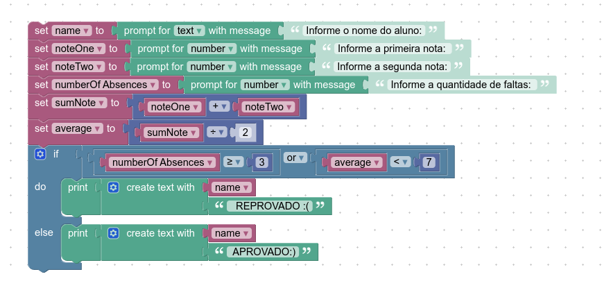

# INSTRUÇÕES DO PROJETO:

 ## Desenvolva, utilizando o Google Blockly, um programa que utiliza o nome de um aluno, duas notas e a quantidade de faltas que ele teve. Conclua se o aluno está aprovado ou reprovado de acordo com as especificações:

Se a média do aluno for menor que sete, o sistema deve informar o nome do aluno e que ele está reprovado;
Se o aluno possuir mais de três faltas, o sistema deve informar o nome do aluno e que ele está reprovado; Se a média do aluno for maior ou igual a sete, o sistema deve informar o nome do aluno e que ele está aprovado.
No sistema, todos os valores devem estar armazenados em variáveis. 




``` 
var nome;
var notaUm; 
var notaDois;
var numeroDeAusencias;
var somaNotas;
var media;


nome = prompt('Informe o nome do aluno: ');
notaUm = Number(prompt('Informe a primeira nota: '));
notaDois = Number(prompt('Informe a segunda nota: '));
numeroDeAusencias = Number(prompt('Informe a quantidade de faltas: '));

somaNotas = notaUm + notaDois
media = somaNotas / 2;
if (numeroDeAusencias >= 3 | media < 7) {
  console.log('O aluno está REPROVADO.');
} else {
  console.log('O aluno está APROVADO.');
}

```


